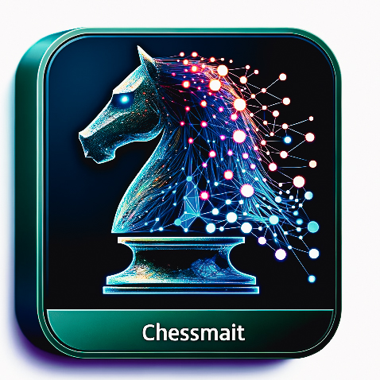

# Chessmait

Chessmait is a chess engine powered by a neural network, designed to take your chess experience to the next
level.  
With its advanced algorithms and strategic prowess, Chessmait is your perfect sparring partner to sharpen your
skills and enjoy thrilling games of chess.  

Whether you're a novice or a grandmaster, Chessmait promises engaging matches that will keep you coming back for more.  
Give it a try and experience the future of chess today.



# For developers

## Set up and handle environment

After cloning the repository, you can create a virtual environment with the necessary dependencies like his:

```shell
$ pipenv install --dev
```

Install a new dependency:

```shell
$ pipenv install <library>
```

Update `Pipfile.lock` with the current state of the virtual environment:

```shell
$ pipenv lock
```

All scripts and tests must always be executed relative to the project's root folder. Make sure `$PYTHONPATH` is set to
your project's root folder.

## Execute the tests

To execute the tests, you can simply call pytest in the project's root directory (if you get an error regarding the
modules, set the variable `$PYTHONPATH` to the project's root path):

```shell
$ pytest
```

## Preprocess the data

### Kaggle

To preprocess the Kaggle data, execute the script [preprocess_kaggle.py](src/preprocessing/preprocess_kaggle.py) from
the project's root directory:

```
$ python src\preprocessing\preprocess_kaggle.py
```

It will preprocess the Kaggle data and a single output csv file will be located
in [data/preprocessed/kaggle](data/preprocessed/kaggle) directory.


