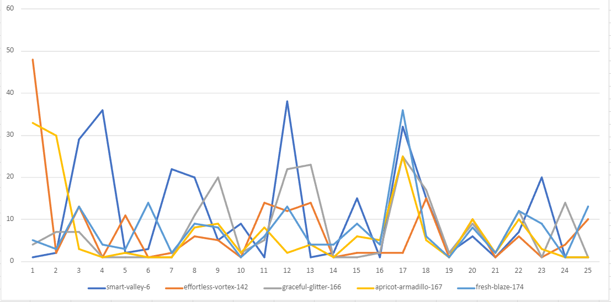

# Results

When analyzing a chess model's performance, various factors are considered. These include traditional machine learning
metrics such as training and validation loss.

## Loss Function

| Model                                                                       | Training Data          | Number of epochs | Neural Network | Loss function | Training loss | Validation loss | Comment                  |
|-----------------------------------------------------------------------------|------------------------|------------------|----------------|---------------|---------------|-----------------|--------------------------|
| [smart-valley-6](https://wandb.ai/chessmait/chessmait/runs/nsr3fgu3)        | 1.6 million positions  | 15               | MLP            | MSE           | 0.63          | 0.22            |                          |
| [effortless-vortex-142](https://wandb.ai/chessmait/chessmait/runs/ncf2q0rz) | 5.2 million positions  | 30               | CNN            | Huber Loss    | 51.9          | 95.6            |                          |
| [graceful-glitter-166](https://wandb.ai/chessmait/chessmait/runs/jle1wzp7)  | 15.8 million positions | 15               | MLP            | Huber Loss    | 124.8         | 127.0           |                          |
| [apricot-armadillo-167](https://wandb.ai/chessmait/chessmait/runs/z5ras9pj) | 17.3 million positions | 15               | MLP            | Huber Loss    | 163.0         | 162.3           | Contained mate positions |
| [fresh-blaze-174](https://wandb.ai/chessmait/chessmait/runs/m70b0o0m)       | 7.7 million positions  | 50               | CNN            | Huber Loss    | 50.6          | 122.2           | Contained mate positions |

In addition to Mean Squared Error and Huber Loss, we experimented with a custom loss function. However, this did not
yield better results than Pytorch's built-in losses
(see [chessmait5-mse-adam](https://wandb.ai/chessmait/chessmait/runs/7wkgtgig)
vs. [chessmait5-customloss-adam](https://wandb.ai/chessmait/chessmait/runs/l3ddtxyp)).
Consequently, we reverted to using Huber Loss, a type of MAE (mean absolute error), for its clarity and
interpretability. For instance, a MAE of 124 indicates the model's prediction is off by approximately 1.24 (slightly
more than a pawn).

Our Convolutional Neural Network exhibited signs of overfitting, as evidenced by the significant disparity between
training and validation losses. Although the Multilayer Perceptron (MLP) displayed higher loss values, their proximity
suggests a more reliable performance. In scenarios involving mate positions, the loss is higher (as expected, since the
evaluation range (2000 to -2000) is broader compared to non-mate positions (1000 to -1000)).

## Kaufman Test

In addition to standard performance metrics, we evaluated how effectively our models play chess. Prior to testing them
against other engines or each other, we conducted the [Kaufman test](https://www.chessprogramming.org/Kaufman_Test),
which involves 25 challenging positions where the model predicts the next best move.

The results are shown in the table below, indicating the ranking of the model's suggested move by Stockfish among all
possible moves. A lower number signifies a better move by the model, with the ideal being 1.

| Position                        | smart-valley-6 | effortless-vortex-142 | graceful-glitter-166 | apricot-armadillo-167 | fresh-blaze-174 | Mean | Number of pieces |
|---------------------------------|----------------|-----------------------|----------------------|-----------------------|-----------------|------|------------------|
| 1                               | **1**          | 48                    | 4                    | 33                    | 5               | 18.2 | 26               |
| 2                               | 2              | 2                     | 7                    | 30                    | 3               | 8.8  | 22               |
| 3                               | 29             | 13                    | 7                    | 3                     | 13              | 13   | 19               |
| 4                               | 36             | **1**                 | **1**                | **1**                 | 4               | 8.6  | 29               |
| 5                               | 2              | 11                    | **1**                | 2                     | 3               | 3.8  | 19               |
| 6                               | 3              | **1**                 | **1**                | **1**                 | 14              | 4    | 20               |
| 7                               | 22             | 2                     | **1**                | **1**                 | 2               | 5.6  | 30               |
| 8                               | 20             | 6                     | 11                   | 8                     | 9               | 10.8 | 15               |
| 9                               | 5              | 5                     | 20                   | 9                     | 8               | 9.4  | 23               |
| 10                              | 9              | **1**                 | 2                    | 2                     | **1**           | 3    | 20               |
| 11                              | **1**          | 14                    | 5                    | 8                     | 6               | 6.8  | 16               |
| 12                              | 38             | 12                    | 22                   | 2                     | 13              | 17.4 | 16               |
| 13                              | **1**          | 14                    | 23                   | 4                     | 4               | 9.2  | 13               |
| 14                              | 2              | **1**                 | **1**                | **1**                 | 4               | 1.8  | 19               |
| 15                              | 15             | 2                     | **1**                | 6                     | 9               | 6.6  | 22               |
| 16                              | **1**          | 2                     | 2                    | 5                     | 4               | 2.8  | 11               |
| 17                              | 32             | 2                     | 25                   | 25                    | 36              | 24   | 26               |
| 18                              | 15             | 15                    | 17                   | 5                     | 6               | 11.6 | 21               |
| 19                              | 2              | **1**                 | 2                    | **1**                 | **1**           | 1.4  | 22               |
| 20                              | 6              | 10                    | 9                    | 10                    | 8               | 8.6  | 14               |
| 21                              | **1**          | **1**                 | 2                    | 2                     | 2               | 1.6  | 7                |
| 22                              | 7              | 6                     | 12                   | 10                    | 12              | 9.4  | 5                |
| 23                              | 20             | **1**                 | **1**                | 3                     | 9               | 6.8  | 30               |
| 24                              | **1**          | 4                     | 14                   | **1**                 | **1**           | 4.2  | 14               |
| 25                              | **1**          | 10                    | **1**                | **1**                 | 13              | 5.2  | 9                |
| Mean                            | 10.88          | 7.4                   | 7.68                 | 6.96                  | 7.6             |      |                  |
| Median                          | 5              | 4                     | 4                    | 3                     | 6               |      |                  |
| Number of best move evaluations | 7              | 7                     | 8                    | 7                     | 3               |      |                  |

Comparing the Kaufman test results, apricot-armadillo-167 emerges as the top model with the lowest average move rank (
6.96). Meanwhile, graceful-glitter-166 most frequently suggests the best move, achieving this in 8 out of 25 positions,
nearly one in every three.

## Games vs. Computer Engine

| White                 | Black                       | Result  | Link                                          | Model Accurary | Model centipawn loss |
|-----------------------|-----------------------------|---------|-----------------------------------------------|----------------|----------------------|
| graceful-glitter-166  | Lichess Level 3             | 1/2-1/2 | https://lichess.org/aCEivRm7/white            | 77%            | 85                   |
| apricot-armadillo-167 | Lichess Level 3             | 0-1     | https://lichess.org/lgM48gJu/white            | 60%            | 70                   |
| Lichess Level 3       | apricot-armadillo-167       | 1-0     | https://lichess.org/NTLBsvC9                  | 59%            | 120                  |
| Lichess Level 3       | graceful-glitter-166        | 1-0     | https://lichess.org/D6orh1tF                  | 56%            | 144                  |
| apricot-armadillo-167 | Karim-Bot (850) (chess.com) | 1-0     | https://www.chess.com/game/computer/104024995 | 77%            | n/a                  |
| graceful-glitter-166  | Lichess Level 3             | 1-0     | https://lichess.org/NuG12cYA/white            | 96%            | 19                   |
| apricot-armadillo-167 | Lichess Level 3             | 1-0     | https://lichess.org/1j6YIfuF/white            | 98%            | 10                   |
| smart-valley-6        | Lichess Level 3             | 0-1     | https://lichess.org/o0MDSHHy                  | 44%            | 234                  |
| smart-valley-6        | Lichess Level 3             | 0-1     | https://lichess.org/KDp1UW47/white            | 74%            | 99                   |

A game like https://lichess.org/NuG12cYA/white (which was won by the model) is very typically. After 19 moves, it was
mate in 3 for the model, however, it did not find the mate.
This is very typically for graceful-glitter-166, since all moves above +1000 and beyond -1000 were set to that value (to
get rid of outliers), and mate positions were not included.
The model just makes some random moves because all positions are evaluated in the range of +1000, which is not wrong,
but the model cannot do any progress.